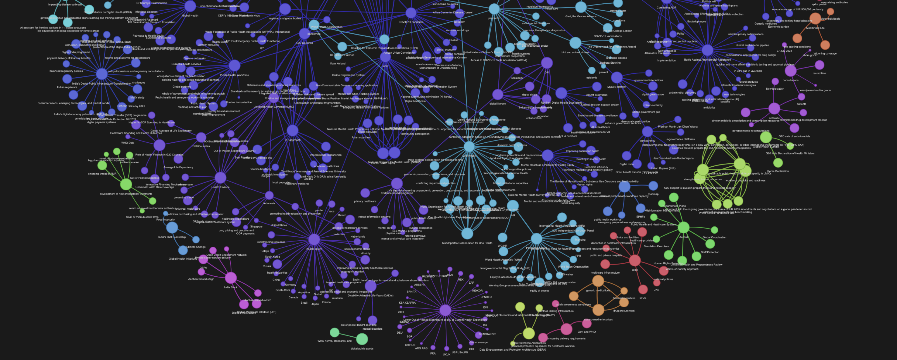

# Convert any Corpus of Text into a *Graph of Knowledge*

*A knowledge graph generated using this code* 
ghpages link of this graph: https://rahulnyk.github.io/knowledge_graph/

## What is a knowledge graph?
A knowledge graph, or semantic network, visualizes a network of real-world entities—such as objects, events, situations, or concepts—and their interconnections. Typically stored in a graph database, knowledge graphs are displayed as interconnected nodes and edges, reflecting the relationships between entities.

Source: https://www.ibm.com/topics/knowledge-graph

## How to create a simple knowledge graph from a body of work?
1. Clean the Text Corpus: Prepare the body of work by removing unnecessary elements.
2. Extract Concepts and Entities: Identify and extract key concepts and entities from the text.
3. Determine Relationships: Identify relationships between these entities.
4. Define the Graph Schema: Create a schema for the graph structure.
5. Populate the Graph: Add nodes (concepts) and edges (relationships) based on the extracted data.
6. Visualize and Query: Optionally, visualize the graph and perform queries. Graphs are visually appealing and can be analyzed to gain insights into the text.

## Why Graph?
Knowledge graphs are valuable for various purposes:
1. Graph Algorithms: Calculate node centralities to determine the importance of concepts.
2. Community Detection: Identify clusters of related concepts.
3. Connectedness Analysis: Explore connections between seemingly unrelated concepts.
4. Graph Retrieval Augmented Generation (GRAG): Enhance interaction with the text using graphs for more profound queries compared to traditional Retrieval Augmented Generation (RAG).
---

## This project
This project demonstrates how to generate a knowledge graph from a PDF document. The approach involves:

1. Splitting Text: Dividing the text into chunks.
2. Concept Extraction: Using a language model to identify concepts and their relationships within each chunk.
3. Contextual Relationships: Establishing relationships between concepts mentioned in the same text chunk.
4. Graph Construction: Creating nodes and edges based on extracted concepts and relationships.
5. The process is simplified and run locally using the Mistral 7B model, which is cost-effective and efficient. 

The detailed steps are documented in the **[extract_graph.ipynb](https://github.com/rahulnyk/knowledge_graph/blob/main/extract_graph.ipynb)**

The notebook implements the method outlined in the following flowchart. 

**[Here is a Medium article explaining the method in detail ](https://medium.com/towards-data-science/how-to-convert-any-text-into-a-graph-of-concepts-110844f22a1a)**

---
## Tech Stack

### Mistral 7B

I am using the [Mistral 7B Openorca](https://huggingface.co/Open-Orca/Mistral-7B-OpenOrca) for extracting concepts out of text chunks. It can follow the system prompt instructions very well. 

### Ollama

Ollama makes it easy to host any model locally. Mistral 7B OpenOrca version is already available with Ollama to use out of the box. 

To set up this project, you must install Ollama on your local machine. 

Step 1: Install Ollama https://ollama.ai

Step 2: run `ollama run zephyr` in your terminal. This will pull the zephyr model to your local machine and start the Ollama server.

### Pandas 
dataframes for graph schema (can use a graphdb at a later stage).

### NetworkX 
<a href="https://networkx.org"><a/>

This is a python library that makes dealing with graphs super easy

### Pyvis
[Pyvis python library](https://github.com/WestHealth/pyvis/tree/master) for visualisation. Pyvis generates Javascript Graph visualisations using python, so the final graphs can be hosted on the web. For example the [github link of this repo](https://rahulnyk.github.io/knowledge_graph/) is a graph generated by pyvis
